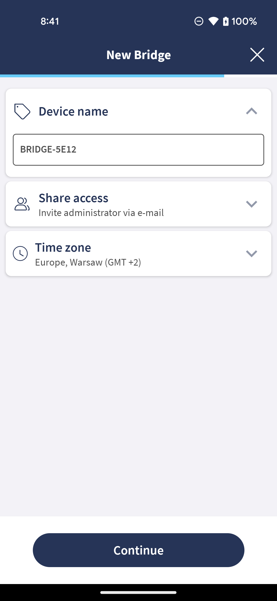
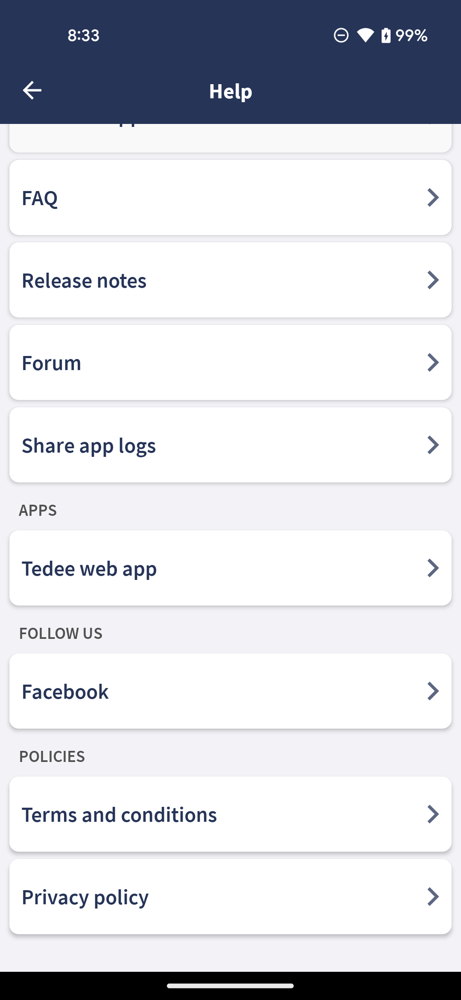
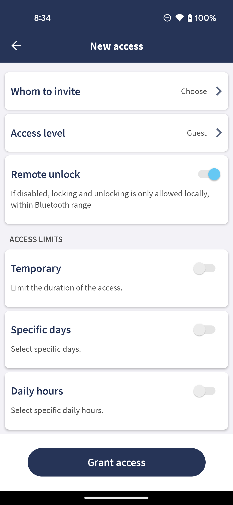
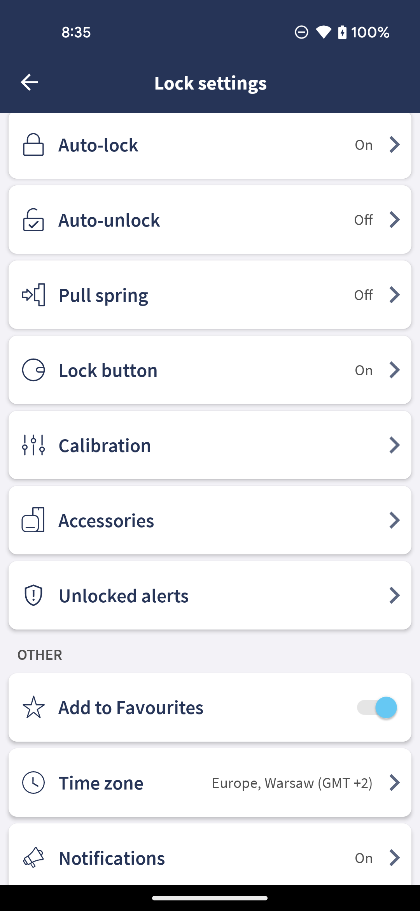
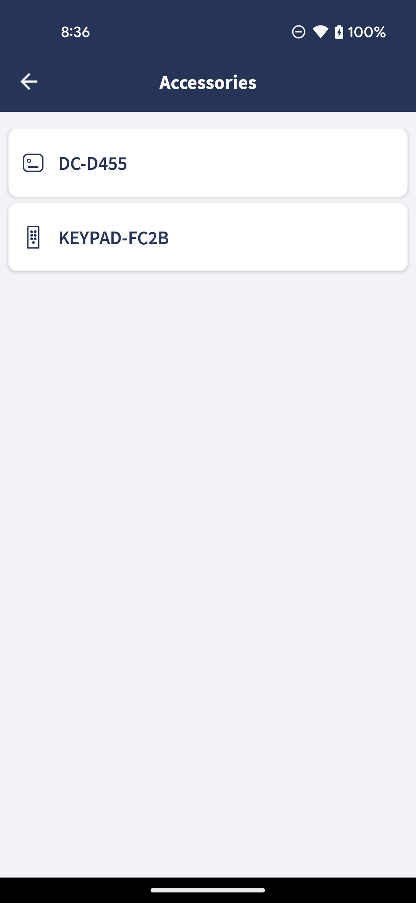

## Faster Name Changing in Quick Settings
We’ve made it faster to change device names in the Quick Settings during the device setup process.

## Removal of Twitter Button
We removed the Twitter button from the "Follow Us" section in our app.

## Simplified Time Restriction Texts
We simplified the restriction texts across all devices to make them consistent.

## Accessory Information Moved in Lock Settings
In the Lock Settings, we moved information about accessories paired with your lock to a separate screen.

